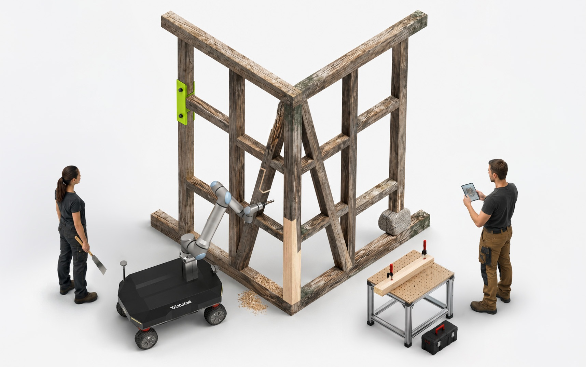
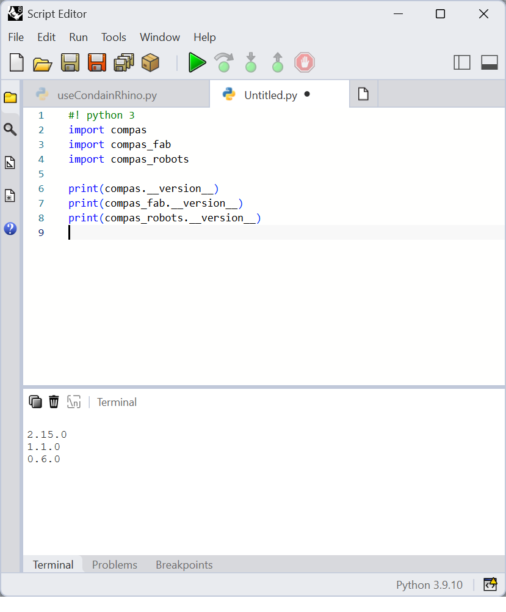

============================================================
Actionable Repair: RobArch Workshop 2026
============================================================

.. start-badges

.. image:: https://img.shields.io/badge/License-MIT-blue.svg
    :target: https://github.com/augmentedfabricationlab/workshop_robarch_2026/blob/master/LICENSE
    :alt: License MIT

.. image:: https://travis-ci.org/augmentedfabricationlab/workshop_robarch_2026.svg?branch=master
    :target: https://travis-ci.org/augmentedfabricationlab/workshop_robarch_2026
    :alt: Travis CI

.. end-badges

.. Write project description

Introduction
-------------
Welcome the Augmented Repair wokshop at ROB|ARCH 2026. This workshop will explore the intersection of robotics, architecture, and repair techniques.
You will engage in hands-on activities to learn about innovative repair methods using LLM-based information, robotic tools, and manual and digital fabrication technologies.

Project Website
-------------
We have created a website for this workshop. This can be found at: `https://augmentedfabricationlab.github.io/workshop_robarch_2026/ <https://augmentedfabricationlab.github.io/workshop_robarch_2026/>`_. We will regularly update the website with information about the workshop, including schedules, materials, and resources.

.. Main features
-------------

.. Documentation
-------------

.. Explain how to access documentation: API, examples, etc.

..
.. optional sections:

Requirements
------------

Participants for this workshop should have a basic understanding of Rhino, Grasshopper, and Python programming. 

The following are to be needed for the workshop:

* Rhino 8 (If you do not have Rhino licenses, you can download a free trial from the Rhino website).
* Python 3.9 installed in Rhinocode environment. To do this Run ``ScriptEditor`` command in Rhino 8 and it should install the Python in the required location
* Check the folder if it exists: ``C:\Users\<username>\.rhinocode\py39-rh8``. If it does not exist, that means python is not installed. Ask the instructors or your peers for troubleshooting.
* You need to clone certain repositories from GitHub to your local machine. In your ``C:\Users\<username>`` folder, create a new folder called ``workspace`` and another subfolder called ``projects``. Then clone the following repositories into the ``projects`` folder: 

    * `workshop_robarch_2026 <https://github.com/augmentedfabricationlab/workshop_robarch_2026>`_
    * `assembly_information_model <https://github.com/augmentedfabricationlab/assembly_information_model>`_
    * `ur_fabrication_control <https://github.com/augmentedfabricationlab/ur_fabrication_control>`_
    * `fabrication_manager <https://github.com/augmentedfabricationlab/fabrication_manager>`_
    * `mobile_robot_control <https://github.com/augmentedfabricationlab/mobile_robot_control>`_

Installation
------------
* Open Rhino 8 and run the ``ScriptEditor`` command.

* In the Script Editor window, go to **Tools > Options** and add the cloned Git repositories' ``src`` folders to the **Module Search Paths**.

  .. image:: docs/images/ScriptEditor.png
      :width: 400px
      :alt: Script Editor Options

* Navigate to the ``C:\Users\<username>\.rhinocode\py39-rh8`` folder and run the following command in a Command Prompt to install the project dependencies:

  .. code-block:: bash

      C:\Users\<username>\.rhinocode\py39-rh8\python.exe -m pip install -r C:\Users\<username>\workspace\projects\assembly_information_model\src

* Install COMPAS, COMPAS FAB, and COMPAS Robots using the following commands:

  .. code-block:: bash

      C:\Users\<username>\.rhinocode\py39-rh8\python.exe -m pip install compas==2.15.0
      C:\Users\<username>\.rhinocode\py39-rh8\python.exe -m pip install compas_fab==1.1.0
      C:\Users\<username>\.rhinocode\py39-rh8\python.exe -m pip install compas_robots==0.6.0

* Once all dependencies have been installed, run the following Python code in the Script Editor to verify that the installation was successful:

  
.. code-block:: python

    #! python 3
    import compas
    import compas_fab
    import compas_robots

    print(compas.__version__)
    print(compas_fab.__version__)
    print(compas_robots.__version__)

.. Contributing
------------

Make sure you setup your local development environment correctly:

* Clone the `workshop_robarch_2026 <https://github.com/augmentedfabricationlab/workshop_robarch_2026>`_ repository.
* Install development dependencies and make the project accessible from Rhino:

::

    pip install -r requirements-dev.txt
    invoke add-to-rhino

**You're ready to start working!**

During development, use tasks on the
command line to ease recurring operations:

* ``invoke clean``: Clean all generated artifacts.
* ``invoke check``: Run various code and documentation style checks.
* ``invoke docs``: Generate documentation.
* ``invoke test``: Run all tests and checks in one swift command.
* ``invoke add-to-rhino``: Make the project accessible from Rhino.
* ``invoke``: Show available tasks.

For more details, check the `Contributor's Guide <CONTRIBUTING.rst>`_.

.. Releasing this project
----------------------

.. Write releasing instructions here

.. end of optional sections
..

Credits
-------------

This repository was created by Tizian Rein (`@tizianrein <https://github.com/tizianrein>`_),
Begum Saral (`@begums <https://github.com/begums>`_), and
Avishek Das (`@a-vi-shek <https://github.com/a-vi-shek>`_)
at the `Augmented Fabrication Lab <https://github.com/augmentedfabricationlab>`_.
